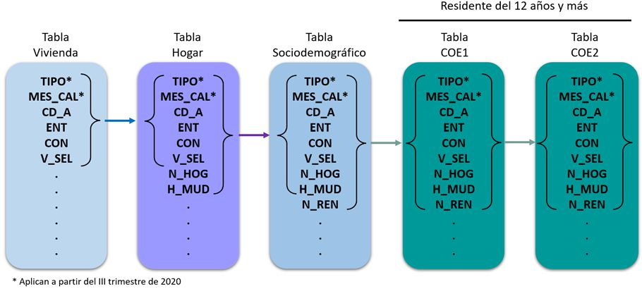
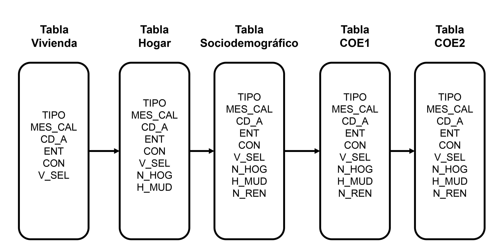

Diagrama

```{dot}
//| label: fig-proceso
//| fig-cap: "Representación esquemática de las fases de la investigación."
//| fig-width: 8
//| fig-align: center

digraph G {
  # Configuración para APA: Fondo blanco y layout horizontal
  bgcolor="white";
  rankdir=LR;
  nodesep=0.5;
  
  # Estilo de los nodos (Cajas)
  # Usamos shape=none para que las llaves parezcan el contenedor
  node [
    shape=none, 
    fontname="Helvetica,Arial,sans-serif",
    fontsize=11,
    color="#333333"
  ];

  # Estilo de las flechas (Sencillas y profesionales)
  edge [
    color="#444444", 
    arrowsize=0.8, 
    penwidth=1.2
  ];

  # Definición de nodos con llaves y formato APA
  C1 [label=< 
    <table border="0" cellborder="0" cellspacing="0">
      <tr><td><b>{</b></td><td> <b>Fase 1</b><br/>Concepto 1<br/>Concepto 2 </td><td><b>}</b></td></tr>
    </table> >];
    
  C2 [label=< 
    <table border="0" cellborder="0" cellspacing="0">
      <tr><td><b>{</b></td><td> <b>Fase 2</b><br/>Análisis 1<br/>Análisis 2 </td><td><b>}</b></td></tr>
    </table> >];

  C3 [label=< 
    <table border="0" cellborder="0" cellspacing="0">
      <tr><td><b>{</b></td><td> <b>Fase 3</b><br/>Diseño 1<br/>Diseño 2 </td><td><b>}</b></td></tr>
    </table> >];

  C4 [label=< 
    <table border="0" cellborder="0" cellspacing="0">
      <tr><td><b>{</b></td><td> <b>Fase 4</b><br/>Pruebas 1<br/>Pruebas 2 </td><td><b>}</b></td></tr>
    </table> >];

  C5 [label=< 
    <table border="0" cellborder="0" cellspacing="0">
      <tr><td><b>{</b></td><td> <b>Fase 5</b><br/>Reporte 1<br/>Reporte 2 </td><td><b>}</b></td></tr>
    </table> >];

  # Conexiones
  C1 -> C2 -> C3 -> C4 -> C5;
}
```

```{dot}
//| label: fig-proceso-tesis
//| fig-cap: "Relación de las tablas de la ENOE mediante las llaves principales."
digraph G {
  # Configuración horizontal (Left to Right)
  rankdir=LR;
  
  # Estilo global de los nodos
  node [shape=box, style="rounded"];

  # Definición de los nodos con etiquetas tipo HTML
  C1 [label=< 
    <b>Tabla Vivienda</b>
    <br/>TIPO
    <br/>MES_CAL
    <br/>CD_A
    <br/>ENT
    <br/>CON
    <br/>V_SEL
  >];
  C2 [label=<
    <b>Tabla Hogar</b>
    <br/>TIPO
    <br/>MES_CAL
    <br/>CD_A
    <br/>ENT
    <br/>CON
    <br/>V_SEL
    <br/>N_HOG
    <br/>H_MUD
  >];
  C3 [label=< <b>Tabla Sociodemográfico</b><br/>Texto 1<br/>Texto 2 >];
  C4 [label=< <b>Tabla COE1</b><br/>Texto 1<br/>Texto 2 >];
  C5 [label=< <b>Tabla COE2</b><br/>Texto 1<br/>Texto 2 >];

  # Relaciones
  C1 -> C2 -> C3 -> C4 -> C5;
}
```

```{dot}
//| label: fig-proceso-tesis
//| fig-cap: "Relación de las tablas de la ENOE mediante las llaves principales."
//| fig-width: 4

digraph G {
  # Configuración horizontal (Left to Right)
  rankdir=LR;
  
  # 1. REDUCIR ESPACIOS: ranksep junta más las flechas horizontales
  ranksep=0.3; 
  
  # 2. OPTIMIZAR NODOS: Reducimos tamaño de letra y márgenes internos
  node [
    shape=box, 
    style="rounded",
    fontsize=9,         # Letra más pequeña (ideal para APA en PDF)
    margin="0.05,0.05"   # Menos espacio en blanco dentro de la caja
  ];

  # Definición de los nodos con etiquetas tipo HTML
  C1 [label=< 
    <b>Tabla Vivienda</b>
    <br/>TIPO
    <br/>MES_CAL
    <br/>CD_A
    <br/>ENT
    <br/>CON
    <br/>V_SEL
  >];
  
  C2 [label=<
    <b>Tabla Hogar</b>
    <br/>TIPO
    <br/>MES_CAL
    <br/>CD_A
    <br/>ENT
    <br/>CON
    <br/>V_SEL
    <br/>N_HOG
    <br/>H_MUD
  >];
  
  C3 [label=< <b>Tabla Sociodemográfico</b><br/>Texto 1<br/>Texto 2 >];
  C4 [label=< <b>Tabla COE1</b><br/>Texto 1<br/>Texto 2 >];
  C5 [label=< <b>Tabla COE2</b><br/>Texto 1<br/>Texto 2 >];

  # Relaciones
  C1 -> C2 -> C3 -> C4 -> C5;
}
```

No queda

```{dot}
digraph G {
  node [shape=box];
  Usuario -> Interfaz;
  Interfaz -> BaseDeDatos;
  BaseDeDatos -> Interfaz;
}
```

Imagen JPG

{#fig-tablas-enoe fig-align="center"}

Como se observa en @fig-tablas-enoe

{#fig-union-enoe}

Me quedo con la última opción, realizarlo en Power Point, guardarlo como PDF y convertirlo a JPG

Aunque también puedo crear una tabla que muestre las llaves principales así como su descripción, recuerda que uniré solamente `SDEM` con `COE1` y `COE2`
